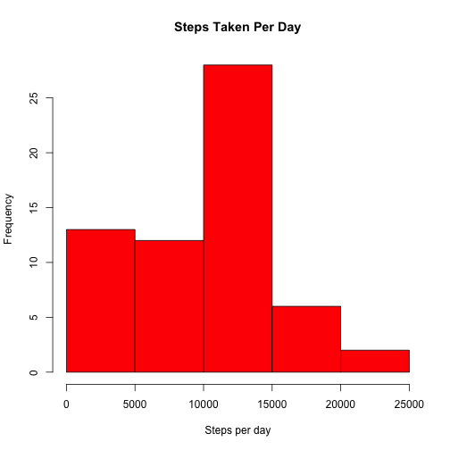
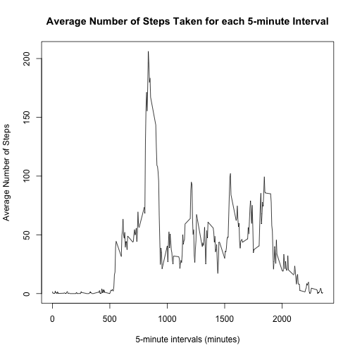
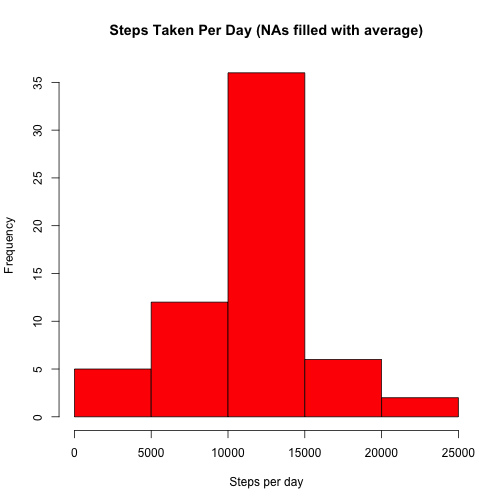
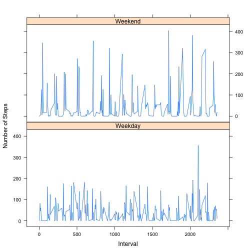

Reproducible Research: Peer Assessment 1
========================================

### Loading dataset file and pre-processing the data
The dataset file is first loaded, and some global objects are extracted with the code chunk below:

```r
file <- read.csv("activity.csv")
```

```
## Warning in file(file, "rt"): cannot open file 'activity.csv': No such file
## or directory
```

```
## Error in file(file, "rt"): cannot open the connection
```

```r
date <- file[, "date"]
datefac <- levels(file[, "date"])
steps <- file[, "steps"]
interval <- file[, "interval"]
```


### What is mean total number of steps taken per day?
A histogram of the total number of steps taken per day are generated with the code chunk below:

```r
stepsperdate <- tapply(steps, date, sum, na.rm = T, simplify = F) # Returns an array
stepsperday <- as.numeric(stepsperdate) # Convert the array into a numeric vector
stepsTable <- data.frame(datefac, stepsperday) 
with(stepsTable, hist(stepsperday, col = "red1", main = "Steps Taken Per Day", xlab = "Steps per day"))
```

 

The mean and median total number of steps taken per day are calculated as follows:

```r
stepsperdaymean <- mean(stepsTable[, "stepsperday"]) # No need for na.rm = T as has been done in sum
stepsperdaymedian <- median(stepsTable[, "stepsperday"])
```
The mean is 9354.2295082 while the median is 1.0395 &times; 10<sup>4</sup>.


### What is the average daily activity pattern?
This code chunk is to create a table of steps taken for each day in columns:

```r
numofdays <- length(datefac)
daystepchunks <- (split(file[, "steps"], date)) # Split data according to dates and returns a list
intervaltable <- NULL
for (i in 1:numofdays) {
        intervaltable <- data.frame(c(intervaltable, daystepchunks[i]))
}
```
This finds the mean for each intervals (using values across the table for each row):

```r
meanlist <- rowMeans(intervaltable, na.rm = T)
```
A final table is created for the daily intervals against mean values across all days:

```r
dayintervalchunks <- (split(file[, "interval"], date)) 
onedayinterval <- dayintervalchunks[[1]]
meantable <- data.frame(onedayinterval, meanlist)
```
Here is the plot of daily interval against average steps taken across all days:

```r
with(meantable, plot(onedayinterval, 
                     meanlist, 
                     main = "Average Number of Steps Taken for each 5-minute Interval", 
                     type = "l", 
                     xlab = "5-minute intervals (minutes)", 
                     ylab = "Average Number of Steps")
)
```

 

To find the 5-minute interval with maximum number of steps:

```r
maxnumofsteps <- max(meanlist)
intervalofmax <- subset(meantable, meanlist == maxnumofsteps, select = onedayinterval)
```
Maximum daily average number of steps taken occurs at the 5-minute interval between 835 and 840 mins.


### Imputing missing values
To calculate and report the total number of NAs in the dataset:

```r
nasteps <- steps[is.na(steps)]
length(nasteps)
```

```
## [1] 2304
```
To create a new dataset with NAs filled in with mean value for the corresponding 5-minute interval:

```r
numofintervals <- length(onedayinterval) # Number of 5-min intervals per day
newdaystepchunks <- daystepchunks # New list of daily steps values where NAs will be filled
filledsteps <- NULL # New vector of steps data
for (i in 1:numofdays) {
        for (j in 1:numofintervals) {
                newdaystepchunks[[i]][[j]][is.na(newdaystepchunks[[i]][[j]])] <- meanlist[j]
                filledsteps <- c(filledsteps, newdaystepchunks[[i]][[j]]) 
        }
}
newfile <- data.frame(filledsteps, date, interval)
```
And to draw a new histogram of the total number of steps taken per day (NAs filled with average):

```r
newdate <- newfile[, "date"]
newsteps <- newfile[, "filledsteps"]
newstepsperdate <- tapply(newsteps, newdate, sum, na.rm = T, simplify = F) # Returns an array
newdatefac <- levels(newfile[, "date"])
newstepsperday <- as.numeric(newstepsperdate) # Convert the array into a numeric vector
newstepsTable <- data.frame(newdatefac, newstepsperday) 
with(newstepsTable, hist(newstepsperday, 
                         col = "red1", 
                         main = "Steps Taken Per Day (NAs filled with average)", 
                         xlab = "Steps per day")
)
```

 

A new mean and median total number of steps taken per day are calculated as follows:

```r
newstepsperdaymean <- mean(newstepsTable[, "newstepsperday"]) # No need for na.rm = T as has been done in sum
newstepsperdaymedian <- median(newstepsTable[, "newstepsperday"])
```
The new mean is 1.0766189 &times; 10<sup>4</sup> while the median is 1.0766189 &times; 10<sup>4</sup>.

The new mean and median values differ from the previous estimates. Both are now of higher values. Also, they are now equal to each other.

### Are there differences in activity patterns between weekdays and weekends?
A new data set with weekday-type column needs to be created:

```r
formatnewdate <- as.Date(newdate) # Format to Date class
dayofweek <- weekdays(formatnewdate)
WeekdayOrWeekend <- function(weekday) {
        if((weekday != "Saturday") && (weekday != "Sunday")) {"Weekday"} else {"Weekend"}
}
WeekdayType <- sapply(dayofweek, WeekdayOrWeekend)
fileWithWeekdayType <- data.frame(newfile, WeekdayType)
```
Again, we create a table of steps taken for each WEEKDAY in columns:

```r
file.weekday <- subset(fileWithWeekdayType, WeekdayType == "Weekday", select = c(date, filledsteps))
weekdaysdates <- levels(factor(file.weekday[, "date"])) # levels(file.weekday[, "date"]) will give the original dates before subsetting
numofdays.weekday <- length(weekdaysdates)
weekdaystepchunks <- (split(file.weekday[, "filledsteps"], weekdaysdates)) # Returns a list
intervaltable.weekday <- NULL
for (i in 1:numofdays.weekday) {
        intervaltable.weekday <- data.frame(c(intervaltable.weekday, weekdaystepchunks[i]))
}
```
And find the mean for each intervals (using values across the table for each row) for WEEKDAYS:

```r
meanlist <- rowMeans(intervaltable.weekday)
```
A final table is created for the daily intervals against mean values across all days, with "Weekday" factor column:

```r
WeekdayType <- rep("Weekday", length(onedayinterval))
meantable.weekday <- data.frame(onedayinterval, meanlist, WeekdayType)
```
Repeat the same for WEEKEND data:

```r
file.weekend <- subset(fileWithWeekdayType, WeekdayType == "Weekend", select = c(date, filledsteps))
weekenddates <- levels(factor(file.weekend[, "date"])) # levels(file.weekend[, "date"]) will give the original dates before subsetting
numofdays.weekend <- length(weekenddates)
weekendstepchunks <- (split(file.weekend[, "filledsteps"], weekenddates)) # Returns a list
intervaltable.weekend <- NULL
for (i in 1:numofdays.weekend) {
        intervaltable.weekend <- data.frame(c(intervaltable.weekend, weekendstepchunks[i]))
}
meanlist <- rowMeans(intervaltable.weekend)
WeekdayType <- rep("Weekend", length(onedayinterval))
meantable.weekend <- data.frame(onedayinterval, meanlist, WeekdayType)
```
The data frames for WEEKDAYS and WEEKENDS are then combined:

```r
meantable.weekdaytype <- rbind(meantable.weekday, meantable.weekend)
```
The final plot of the mean number of steps taken for WEEKDAYS & WEEKENDS (Lattice Panel Plot)

```r
library(lattice)
xyplot(meanlist ~ onedayinterval | WeekdayType, 
       data = meantable.weekdaytype, 
       layout = c(1, 2), type = "l", 
       xlab = "Interval", 
       ylab = "Number of Steps"
)
```

 
